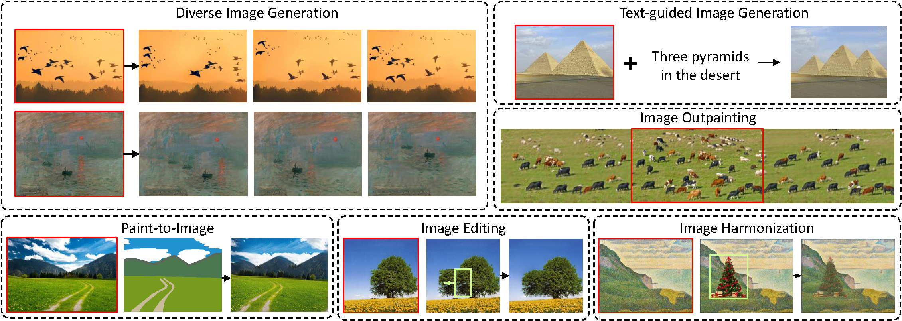
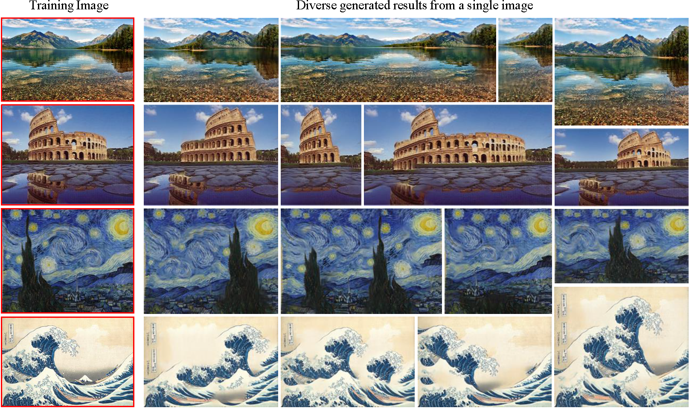
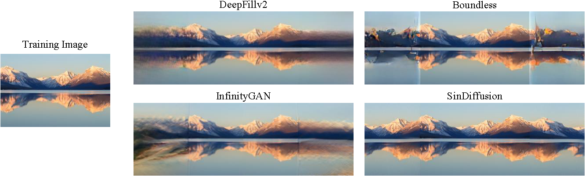

# SinDiffusion: Learning a Diffusion Model from a Single Natural Image

Official PyTorch implementation of "SinDiffusion: Learning a Diffusion Model from a Single Natural Image".
The code aims to allow the users to reproduce and extend the results reported in the study. Please cite the paper when reporting, reproducing or extending the results.

[[Arxiv](https://arxiv.org/abs/2211.12445)] [[Project (Comming Soon)]()]

# Overview

This repository implements the SinDiffusion model, leveraging denoising diffusion models to capture internal distribution of patches from a single natural image. 
SinDiffusion significantly improves the quality and diversity of generated samples compared with existing GAN-based approaches. 
It is based on two core designs. 
First, SinDiffusion is trained with a single model at a single scale instead of multiple models with progressive growing of scales which serves as the default setting in prior work. 
This avoids the accumulation of errors, which cause characteristic artifacts in generated results.
Second, we identify that a patch-level receptive field of the diffusion network is crucial and effective for capturing the image's patch statistics, therefore we redesign the network structure of the diffusion model.
Extensive experiments on a wide range of images demonstrate the superiority of our proposed method for modeling the patch distribution.

<p align="center">

</p>

## Generation Results
* **Generated images of arbitary resolution:**
<p align='center'>  
  
</p>

* **High-resolution single image generation:**
<p align='center'>  
  
</p>

## Prerequisites
- Linux
- Python 3
- CPU or NVIDIA GPU + CUDA CuDNN

## Datasets
You can use either Places50 dataset in [SinGAN](https://github.com/tamarott/SinGAN) or arbitray images collected online.

## Training the model
To train the model, execute the training scripts in the scripts folder or the following command. 
```bash
export LOGDIR="OUTPUT/sinddpm-yourimage-day-commitseq"

mpiexec -n 8 python image_train.py --data_dir data/yourimage.png --lr 5e-4 --diffusion_steps 1000 --image_size 256
                                   --noise_schedule linear --num_channels 64 --num_head_channels 16 --channel_mult "1,2,4" 
                                   --attention_resolutions "2" --num_res_blocks 1 --resblock_updown False --use_fp16 True 
                                   --use_scale_shift_norm True --use_checkpoint True --batch_size 16
```
The experimental results are then saved in the folder ./OUTPUT/sinddpm-(yourimage)-(day)-(commitseq).
Training on 8 NVIDIA Tesla V100 is recommended. 

## Testing the model
To test a trained model, execute the testing scripts in the scripts folder or the following command. 
```bash
python image_sample.py --data_dir data/yourimage.png --diffusion_steps 1000 --image_size 256 --noise_schedule linear
                       --num_channels 64 --num_head_channels 16 --num_res_blocks 1 --channel_mult "1,2,4"
                       --attention_resolution "2" --resblock_updown False --use_fp16 True --use_scale_shift_norm True 
                       --use_checkpoint True --model_root OUTPUT/sinddpm-yourimage-day-commitseq 
                       --results_path RESULT/sinddpm-yourimage-day-commitseq/
```
These testing results are then saved in the folder ./RESULT/sinddpm-(yourimage)-(day)-(commitseq)/.

## Pretrained models (Comming Soon)
The pre-trained models will be released soon.

## Image Manipulation
* **Text-guided image generation:**
<p align='center'>  
  
</p>

* **Image Outpainting:**
<p align='center'>  
  
</p>

# Additional information

## Citation
If you use this work please cite
```
@article{wang2022sindiffusion,
  title={SinDiffusion: Learning a Diffusion Model from a Single Natural Image},
  author = {Wang, Weilun and Bao, Jianmin and Zhou, Wengang and Chen, Dongdong and Chen, Dong and Yuan, Lu and Li, Houqiang},
  journal={arXiv preprint arXiv:2211.12445},
  year={2022}
}
```

## Acknowledge
Our code is developed based on [guided-diffusion](https://github.com/openai/guided-diffusion). We also thank [SinGAN](https://github.com/tamarott/SinGAN) for SIFID computation, [stargan-v2](https://github.com/clovaai/stargan-v2) for LPIPS computation.

## Contact
Please feel free to open an issue or contact us personally if you have questions, need help, or need explanations.
Write to one of the following email addresses: **wwlustc** at **mail** dot **ustc** dot **cn**.
